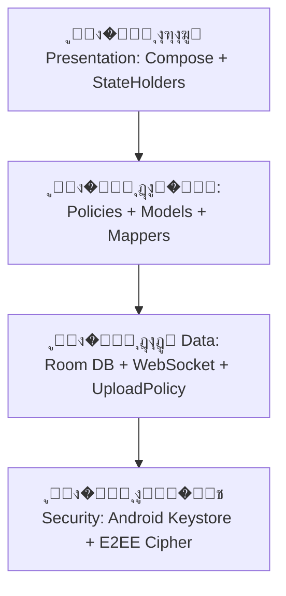

# ุฏูุชุฑ ฺฉู„ ุดฺฉุงูโ€Œู‡ุง�Œ ฺ†ุช (Chat Gap Ledger)
**ูพุฑูˆฺ˜ู‡:** Vista Native Android (`E:\vista_native`)  
**ู…ุฑุฌุน ูู‚ุท-ุฎูˆุงู†ุฏู†�Œ ู‚ุงุจู„�Œุชโ€Œู‡ุง:** Vista Flutter (`E:\vista`)  
**ู…ุฑุฌุน ู…ุดุงู‡ุฏู‡โ€Œุง�Œ ุชุนุงู…ู„ุงุช:** Telegram UX (`E:\tmp\Telegram`)  
**ุงุณุชุงู†ุฏุงุฑุฏ ู‡ุฏู:** Telegram-Level Polish & Architecture  
**ุชุงุฑ�Œุฎ ู…ู…�Œุฒ�Œ ูˆ ุขุฎุฑ�Œู† ุจุงุฒู†ฺฏุฑ�Œ:** �ฑ�ด�ฐ�ต/�ฐ�ถ/�ฑ�ฑ (2026-09-01)  
**ู…ุนู…ุงุฑ ุงุฑุดุฏ:** Senior Android & Jetpack Compose Architect  

---

## �ฑ. ุฎู„ุงุตู‡ ู…ุฏ�Œุฑ�Œุช�Œ ูˆ ุงู‡ุฏุงู ุจุงุฒุทุฑุงุญ�Œ

ู‡ุฏู ุง�Œู† ุณู†ุฏุŒ ุงุฑุงุฆู‡ ู…ู…�Œุฒ�Œ ููˆู‚โ€Œุฏู‚�Œู‚ุŒ ุณุฎุชโ€Œฺฏ�Œุฑุงู†ู‡ ูˆ ุฌุงู…ุน ุงุฒ ุชู…ุงู…�Œ ุดฺฉุงูโ€Œู‡ุง�Œ ุฑูุชุงุฑ�ŒุŒ ุจุตุฑ�ŒุŒ ูพุง�Œุฏุงุฑ�Œ RecompositionุŒ ู‡ู†ุฏุณู‡ ุญุจุงุจโ€Œู‡ุงุŒ ุณ�Œุณุชู… ุตูˆุช�Œ/ฺ†ู†ุฏุฑุณุงู†ู‡โ€Œุง�ŒุŒ ู…ุฏ�Œุฑ�Œุช ฺฉ�Œุจูˆุฑุฏ ูˆ ุชุนุงู…ู„ุงุช ู„ู…ุณ�Œ ู…�Œุงู† ูพ�Œุงุฏู‡โ€Œุณุงุฒ�Œ ู…ุฑุฌุน ุฏุฑ ูู„ุงุชุฑ (`E:\vista`) ูˆ ูˆุถุน�Œุช ฺฉู†ูˆู†�Œ ุฌุชโ€Œูพฺฉ ฺฉุงู…ูพูˆุฒ ุงู†ุฏุฑูˆ�Œุฏ (`E:\vista_native`) ูˆ ุงุฑุชู‚ุง�Œ ุขู† ุจู‡ ุจุงู„ุงุชุฑ�Œู† ุณุทุญ ุงุณุชุงู†ุฏุงุฑุฏู‡ุง�Œ ุชู„ฺฏุฑุงู… (Telegram-Level Quality) ุงุณุช.

### ุงุตูˆู„ ุจู†�Œุงุฏ�Œู† ู…ุนู…ุงุฑ�Œ:
1. **ุนุฏู… ฺฉูพ�Œโ€Œุจุฑุฏุงุฑ�Œ ุงุฒ ฺฉุฏ/ุฏุงุฑุง�Œ�Œโ€Œู‡ุง�Œ ุชู„ฺฏุฑุงู…:** ุทุฑุงุญ�Œ ูˆ ุณูˆุฑุณ ฺฉุงู…ู„ุงู‹ ุงุฎุชุตุงุต�Œ ุงุณุช ูˆ ุชู„ฺฏุฑุงู… ุตุฑูุงู‹ ุจู‡ ุนู†ูˆุงู† ุงุณุชุงู†ุฏุงุฑุฏ ุจู†ฺ†ู…ุงุฑฺฉ ุฑูุชุงุฑ�Œ ูˆ ุจุตุฑ�Œ ุงุณุชูุงุฏู‡ ู…�Œโ€Œุดูˆุฏ.
2. **ูพุง�Œุฏุงุฑ�Œ ู‚ุฑุงุฑุฏุงุฏ ุงู…ู†�Œุช�Œ E2EE:** ุชู…ุงู… ู‚ุงุจู„�Œุชโ€Œู‡ุง ุจุฑ ู…ุจู†ุง�Œ ุฑู…ุฒู†ฺฏุงุฑ�Œ ู†ุงู…ุชู‚ุงุฑู†/ู…ุชู‚ุงุฑู† ู…ุญู„�Œ (Keystore) ูˆ ุณ�Œุงุณุช Fail-Closed ุนู…ู„ ู…�Œโ€Œฺฉู†ู†ุฏุ› ู‡�Œฺ† ู…ุชุงุฏ�Œุชุง �Œุง ูพ�Œุงู… ู†ุงุงู…ู†�Œ ู„ุงฺฏ ู†ุฎูˆุงู‡ุฏ ุดุฏ.
3. **RTL-First ูˆ ุจูˆู…�Œโ€Œุณุงุฒ�Œ ุฏู‚�Œู‚:** ุชู…ุงู…�Œ ู…ูˆู‚ุน�Œุชโ€Œู‡ุงุŒ ฺ˜ุณุชโ€Œู‡ุงุŒ ููˆู†ุช VazirmatnุŒ ุงุนุฏุงุฏ ูุงุฑุณ�Œ ูˆ ุชุงุฑ�Œุฎโ€Œู‡ุง�Œ ุดู…ุณ�Œ ุจุง ุฏู‚ุช ูพ�Œฺฉุณู„�Œ ุฏุฑ ุญุงู„ุช ุฑุงุณุชโ€Œุจู‡โ€Œฺ†ูพ ูพ�Œุงุฏู‡โ€Œุณุงุฒ�Œ ู…�Œโ€Œุดูˆู†ุฏ.
4. **ุชฺฉโ€Œู…ุงู„ฺฉ�Œุช�Œ ุชุนุงู…ู„ุงุช (Single State Ownership):** ุฌุฏุงุณุงุฒ�Œ ู‚ุทุน�Œ ูˆุถุน�Œุชโ€Œู‡ุง�Œ `Idle`ุŒ `Context` ูˆ `Selecting` ุจุฑุง�Œ ุฌู„ูˆฺฏ�Œุฑ�Œ ุงุฒ ุชุฏุงุฎู„ ฺ˜ุณุชโ€Œู‡ุง ูˆ ุฎุทุงู‡ุง�Œ ุฑู†ุฏุฑ�Œ.

---

## �ฒ. ู…ุงุชุฑ�Œุณ ุฌุงู…ุน ู…ู…�Œุฒ�Œ ูˆ ุงุฑุฒ�Œุงุจ�Œ ุดฺฉุงูโ€Œู‡ุง (Gap Analysis Matrix)

| ุฑุฏ�Œู | ู…ุคู„ูู‡ / ู‚ุงุจู„�Œุช | ู…ุฑุฌุน Flutter (`E:\vista`) | ูˆุถุน�Œุช ูุนู„�Œ Native (`E:\vista_native`) | ุงุณุชุงู†ุฏุงุฑุฏ ู‡ุฏู ุชู„ฺฏุฑุงู… (Telegram Polish) | ูˆุถุน�Œุช ูู†�Œ ูˆ ุงูˆู„ูˆ�Œุช |
| :--- | :--- | :--- | :--- | :--- | :--- |
| **�ฑ** | **ฺ†�Œุฏู…ุงู† ูˆ ู„ู†ฺฏุฑ ู„�Œุณุช| **�ด** | **ฺ†�Œุฏู…ุงู† ู…ุชุงุฏ�Œุชุง ูˆ ุช�Œฺฉโ€Œู‡ุง�Œ ูˆุถุน�Œุช** | ฺ†�Œุฏู…ุงู† ุณูุงุฑุด�Œ `ChatTextBubbleLayout` ุจุง ู…ุญุงุณุจู‡ ุนุฑุถ ุฎุท ุขุฎุฑ | `ChatTextBubbleLayout` ุจุง ู…ุญุงุณุจู‡ ุชฺฉโ€Œู…ุณ�Œุฑู‡ (Single-pass) ุนุฑุถ ู…ุชู† ูˆ ููˆุชุฑ | ู‚ุฑุงุฑฺฏ�Œุฑ�Œ ู…ุชุงุฏ�Œุชุง (ุณุงุนุช + ุช�Œฺฉ) ุฏุฑ ุงู†ุชู‡ุง�Œ ุฎุท ุขุฎุฑ ุฏุฑ ุตูˆุฑุช ูˆุฌูˆุฏ ูุถุง�Œ ุฎุงู„�Œ ุจุฏูˆู† ุดฺฉุณุช ุฎุท ุจ�Œู‡ูˆุฏู‡ (Inline Meta Layout) | โœ… ูพ�Œุงุฏู‡โ€Œุณุงุฒ�Œ ุดุฏู‡ ูˆ ุชุณุชโ€Œุดุฏู‡ |
| **�ต** | **ฺ˜ุณุช ฺฉุด�Œุฏู† ุจุฑุง�Œ ูพุงุณุฎ (Swipe-to-Reply)** | ฺฉุด�Œุฏู† ุงูู‚�Œ ุจุง ุจุงุฒุฎูˆุฑุฏ ู‡ูพุช�Œฺฉ (`HapticFeedback.lightImpact`) | `SwipeToReplyLayout` ุจุง `ReplySwipePolicy` ุฌู‡ุชโ€Œู…ุญูˆุฑ (ฺ†ูพ ุจุฑุง�Œ ูพ�Œุงู… ู…ู†ุŒ ุฑุงุณุช ุจุฑุง�Œ ุทุฑู) | ู…ู‚ุงูˆู…ุช ูู†ุฑ�Œ (Spring Damping)ุŒ ุขุดฺฉุงุฑุณุงุฒ�Œ ุฑูˆุงู† ุข�Œฺฉูˆู† ูพุงุณุฎ ุจุง Scale/RotationุŒ ู„ุบูˆ ู†ุฑู… ุฏุฑ ุตูˆุฑุช ุฑู‡ุงุณุงุฒ�Œ ู‚ุจู„ ุขุณุชุงู†ู‡ | ๐ŸŸก ู†�Œุงุฒู…ู†ุฏ ูพูˆู„�Œุด ู�Œุฒ�Œฺฉ ุงู†�Œู…�Œุดู† ูˆ ุฑูุน ฺฉุงู…ู„ ุชุฏุงุฎู„ ุจุง ุงุณฺฉุฑูˆู„ ุนู…ูˆุฏ�Œ |
| **�ถ** | **ู…ู†ูˆ�Œ ุฒู…�Œู†ู‡ ูˆ ุฑ�Œโ€Œุงฺฉุดู†โ€Œู‡ุง (Context & Reactions)** | ู…ู†ูˆ�Œ ูพุงูพโ€Œุขูพ ุงุฎุชุตุงุต�Œ ุจุง ู†ูˆุงุฑ ุฑ�Œโ€Œุงฺฉุดู†โ€Œู‡ุง�Œ ุณุฑ�Œุน ูˆ ุจู„ูˆุฑ | ุชูพ ูพ�Œุงู… ู…ุชู†�Œ ุจู‡ `MessageContextMenu` ุจุง `boundsInWindow` ู…�Œโ€Œุฑูˆุฏุ› long-press ู…ุฎุชุต Selection ุงุณุช | ูพุณโ€Œุฒู…�Œู†ู‡ ู…ุงุช (Blurred Scrim)ุŒ ูพุงูพโ€Œุขูพ ุฌู‡ู†ุฏู‡ ุจู‡ ู…ูˆู‚ุน�Œุช ุญุจุงุจุŒ ูพุดุช�Œุจุงู†�Œ ุงุฒ ฺฉูพ�ŒุŒ ูพุงุณุฎุŒ ููˆุฑูˆุงุฑุฏุŒ ูพ�Œู†ุŒ ูˆ�Œุฑุง�ŒุดุŒ ุญุฐู ูˆ ูˆุงฺฉู†ุดโ€Œู‡ุง | ๐ŸŸก ุณูˆุฑุณ ูˆ ุชุณุช ุชุบ�Œ�Œุฑ ฺฉุฑุฏู‡ุ› ุจุงุฒูพุฎุด APK ุฌุงุฑ�Œ ู„ุงุฒู… ุงุณุช |
| **�ท** | **ุงู†ุชุฎุงุจ ฺ†ู†ุฏฺฏุงู†ู‡ ูพ�Œุงู…โ€Œู‡ุง (Multi-Selection)** | ฺฉู†ุชุฑู„ุฑ ุงู†ุชุฎุงุจ ุจุง ุณุชูˆู† ฺ†ฺฉโ€Œุจุงฺฉุณ ู…ุชุญุฑฺฉ | ุณุชูˆู† �ด�ธdp ุซุงุจุช ุฏุฑ ู„ุจู‡ ุดุฑูˆุน ุจุง ฺ†ฺฉโ€Œุจุงฺฉุณ ู…ุชุญุฑฺฉ ูˆ ู†ูˆุงุฑ ุจุงู„ุง�Œ�Œ ุนู…ู„�Œุงุช ุฏุณุชู‡โ€Œุฌู…ุน�Œ | ูˆุฑูˆุฏ ุจุง Long-pressุŒ ุชุงฺฏู„ ุจุง ฺฉู„�ŒฺฉุŒ ู‡ู…ฺฏุงู… ุจุง ุฏฺฉู…ู‡ Back ุณ�Œุณุชู…ุŒ ุนุฏู… ุชุบ�Œ�Œุฑ ู‡ู†ุฏุณู‡ ุญุจุงุจ | โœ… ูพ�Œุงุฏู‡โ€Œุณุงุฒ�Œ ุดุฏู‡ |
| **�ธ** | **ฺฉุงุฏุฑ ูˆุฑูˆุฏ�Œ ูพ�Œุงู… ูˆ ฺฉ�Œุจูˆุฑุฏ (Composer & IME)** | ฺ†ู†ุฏุฎุท�Œ ุจุง ุงู†�Œู…�Œุดู† ุชุบ�Œ�Œุฑ ูˆ�Œุณ/ุงุฑุณุงู„ ูˆ ูพู†ู„ ุง�Œู…ูˆุฌ�Œ/ุงุณุช�Œฺฉุฑ | ูพู†ู„ ุงุฒ footprint ูˆุงู‚ุน�Œ IME ุฑุฒุฑูˆ ู…�Œโ€Œุดูˆุฏุ› ุฏุฑุฎูˆุงุณุช ุจุงุฒฺฏุดุช ุจู‡ IME ูพุณ ุงุฒ commit state ูพู†ู„ ุฏุฑ `LaunchedEffect` ุงู†ุฌุงู… ู…�Œโ€Œฺฏ�Œุฑุฏ | ุชุง�Œูพ ุฑูˆุงู† ุจุฏูˆู† ู„ฺฏุŒ ูพุดุช�Œุจุงู†�Œ ุงุฒ Insets ุงุณุชุงู†ุฏุงุฑุฏ ุจุง `Modifier.imePadding()`ุŒ ุณูˆ�Œ�Œฺ† ุจุฏูˆู† ูพุฑุด ุจ�Œู† ฺฉ�Œุจูˆุฑุฏ ูˆ ูพู†ู„ ุฑุณุงู†ู‡ | ๐ŸŸก ุณูˆุฑุณ ุงุตู„ุงุญ ุดุฏุ› APK ุฌุงุฑ�Œ ูˆ replay ุฏู‡โ€Œุจุงุฑู‡ ู„ุงุฒู… ุงุณุช |
| **�น** | **ุฏุงฺฉ ุถุจุท ูพ�Œุงู… ุตูˆุช�Œ (Voice Recording)** | ู†ฺฏู‡โ€Œุฏุงุดุชู† ุจุฑุง�Œ ุถุจุทุŒ ฺฉุด�Œุฏู† ุจู‡ ฺ†ูพ ุจุฑุง�Œ ู„ุบูˆุŒ ู‚ูู„ ุถุจุท | `VoiceRecorderDock` ูˆ `VoiceRecordingInteraction` ุจุง ู…ุฏ�Œุฑ�Œุช ููˆฺฉูˆุณ ุตุฏุง | ู†ู…ุง�Œุด ูุฑู…โ€Œู…ูˆุฌ ุฒู†ุฏู‡ (Live Waveform)ุŒ ุชุง�Œู…ุฑ ุถุจุท ู„ุญุธู‡โ€Œุง�ŒุŒ ุงู†�Œู…�Œุดู† ู„ุฑุฒุด ูˆ ู‚ูู„ ู‡ู†ุฏุฒูุฑ�Œ ุจุง ูพุง�Œุฏุงุฑ�Œ ฺฉุงู…ู„ | ๐Ÿ”„ ุงุฑุชู‚ุง ุจู‡ ุงุณุชุงู†ุฏุงุฑุฏู‡ุง�Œ ุจุตุฑ�Œ ูˆ ูพุง�Œุฏุงุฑ�Œ ู„ุบูˆ/ุงุฑุณุงู„ |
| **�ฑ�ฐ** | **ูพุฎุดโ€Œฺฉู†ู†ุฏู‡ ูพ�Œุงู… ุตูˆุช�Œ (Voice Player)** | ุจุงุจู„ ุงุฎุชุตุงุต�Œ ุจุง ุณุฑุนุช ูพุฎุด (1x, 1.5x, 2x) ูˆ waveform ุชุนุงู…ู„�Œ | `VoicePlayerBubble` ุจุง ฺฉู†ุชุฑู„ุฑ MediaPlayer | ู†ูˆุงุฑ ูพ�Œุดุฑูุช ู‚ุงุจู„ ุฌุงุจุฌุง�Œ�Œ (Seekable Waveform)ุŒ ู†ู…ุง�Œุด ู…ุฏุช ุฒู…ุงู† ูˆ ุณุฑุนุช ูพุฎุด ุจุง ู�Œุฏุจฺฉ ุจุตุฑ�Œ | ๐Ÿ”„ ูพูˆู„�Œุด ุจุตุฑ�Œ ูˆ ู‡ู…ฺฏุงู…โ€Œุณุงุฒ�Œ ูˆุถุน�Œุช ูพุฎุด |
| **�ฑ�ฑ** | **ุฑุณุงู†ู‡ ูˆ ูพ�Œูˆุณุชโ€Œู‡ุง (Media, Video, GIF, Doc)** | ู†ู…ุง�Œุด ุชฺฉ�Œ ูˆ ุขู„ุจูˆู… ุชุตุงูˆ�ŒุฑุŒ ูพู„�Œุฑ ุชู…ุงู… ุตูุญู‡ ูˆ ุงุฏ�Œุชูˆุฑ ู…ุฏ�Œุง | `AttachmentBubble`ุŒ `FullscreenMediaViewerDialog` ูˆ `ChatAttachmentBottomSheet` | ฺฏูˆุดู‡โ€Œู‡ุง�Œ ู…ุชู†ุงุณุจ ุจุง ุญุจุงุจุŒ ู„ูˆุฏ�Œู†ฺฏ ุฏุง�Œุฑู‡โ€Œุง�Œ ูพ�Œุดุฑูุช ุฏุงู†ู„ูˆุฏ/ุขูพู„ูˆุฏ ุฑูˆ�Œ ุชุตูˆ�ŒุฑุŒ ูพ�Œุดโ€Œู†ู…ุง�Œุด ุงุณู†ุงุฏ | ๐Ÿ”„ ุงุฑุชู‚ุง�Œ ู„ุง�Œูˆุช ฺ†ู†ุฏุฑุณุงู†ู‡โ€Œุง�Œ ูˆ ูพ�Œุดุฑูุช ุงู†ุชู‚ุงู„ |
| **�ฑ�ฒ** | **ูพ�Œุดโ€Œู†ู…ุง�Œุด ู„�Œู†ฺฉโ€Œู‡ุง (Link Previews / OpenGraph)** | ฺฉุงุฑุชโ€Œู‡ุง�Œ ุบู†�Œ ูˆุจ ุจุง ุชุตูˆ�Œุฑ ุจู†ุฏุงู†ฺฏุดุช�Œ ูˆ ุฎู„ุงุตู‡ | ุงุณุชุฎุฑุงุฌ ุณุงุฏู‡ ู…ุชู† ู„�Œู†ฺฉ ุจุฏูˆู† ฺฉุงุฑุช ุบู†�Œ | ฺฉุงุฑุช ู…ุชุตู„ ุจู‡ ุจุงุจู„ ู…ุชู† ุจุง ู‚ุงุจู„�Œุช ู„ุบูˆ ูพ�Œุดโ€Œู†ู…ุง�Œุด ุฏุฑ ฺฉุงู…ูพูˆุฒุฑ ูˆ ฺฉุด ู…ุญู„�Œ ู…ุชุงุฏ�Œุชุง | โŒ ูพ�Œุงุฏู‡โ€Œุณุงุฒ�Œ ู†ุดุฏู‡ / ุงูˆู„ูˆ�Œุช ู…ุชูˆุณุท |
| **�ฑ�ณ** | **ู†ู‚ู„โ€Œู‚ูˆู„ ูˆ ู†ุงูˆุจุฑ�Œ ุฑ�Œูพู„ุง�Œ (Reply Quoting & Jump)** | ู†ูˆุงุฑ ู†ู‚ู„โ€Œู‚ูˆู„ ุฑู†ฺฏ�Œ ุจุง ูพุฑุด ุฑูˆุงู† ุจู‡ ูพ�Œุงู… ุงุตู„�Œ | ุจู†ุฑ ุฑ�Œูพู„ุง�Œ ู…ุชู†�Œ ุณุงุฏู‡ ุฏุฑ ู‡ุฏุฑ ุจุงุจู„ | ุฎุท ุจุงุฑ�Œฺฉ ุนู…ูˆุฏ�Œ ุจุง ุฑู†ฺฏ ุงุฎุชุตุงุต�ŒุŒ ู†ุงู… ู†ูˆ�Œุณู†ุฏู‡ ุงุตู„�ŒุŒ ูพุฑุด ุงู†�Œู…�Œุดู†�Œ ุจู‡ ู…ูˆู‚ุน�Œุช ูพ�Œุงู… ูˆ ู‡ุง�Œู„ุง�Œุช ู…ูˆู‚ุช | ๐Ÿ”„ ู†�Œุงุฒู…ู†ุฏ ุงู†�Œู…�Œุดู† ูพุฑุด ูˆ ู‡ุง�Œู„ุง�Œุช |
| **�ฑ�ด** | **ู‡ุฏุง�Œุช ูพ�Œุงู…โ€Œู‡ุง (Message Forwarding)** | ุณุฑุจุฑฺฏ "ู‡ุฏุง�Œุชโ€Œุดุฏู‡ ุงุฒ..." ุจุง ุงู…ฺฉุงู† ุญูุธ �Œุง ุญุฐู ู†ุงู… | ุจู†ุฑ ุณุงุฏู‡ ููˆุฑูˆุงุฑุฏ ุฏุฑ ุฏ�Œุชุงู…ุฏู„ | ุณุฑุจุฑฺฏ ููˆุฑูˆุงุฑุฏ ุชู„ฺฏุฑุงู…�Œ ุจุง ู„�Œู†ฺฉ ุจู‡ ูพุฑูˆูุง�Œู„ ู†ูˆ�Œุณู†ุฏู‡ (ุฏุฑ ุตูˆุฑุช ู…ุฌุงุฒ ุจูˆุฏู† ุญุฑ�Œู… ุฎุตูˆุต�Œ) | ๐Ÿ”„ ู†�Œุงุฒู…ู†ุฏ ุงุฑุชู‚ุง�Œ ุจุตุฑ�Œ |
| **�ฑ�ต** | **ู†ูˆุงุฑ ูพ�Œุงู…โ€Œู‡ุง�Œ ูพ�Œู†โ€Œุดุฏู‡ (Pinned Messages Bar)** | ุจู†ุฑ ฺ†ุณุจุงู† ุจุงู„ุง�Œ ุตูุญู‡ ุจุง ุณูˆ�Œ�Œฺ† ุจ�Œู† ูพ�Œู†โ€Œู‡ุง | `PinnedMessagesBar` ุชุนุงู…ู„�Œ ุจุง ุณูˆุฆ�Œฺ† ุจ�Œู† ฺ†ู†ุฏ ูพ�Œู† ูˆ ู„ุบูˆ ูพ�Œู† | ู†ูˆุงุฑ ุจุงุฑ�Œฺฉ ุฒ�Œุฑ ุงูพโ€Œุจุงุฑ ุจุง ุดู…ุงุฑู†ุฏู‡ ูˆ ุงู†�Œู…�Œุดู† ุณูˆุฆ�Œฺ† ุจ�Œู† ฺ†ู†ุฏ ูพ�Œุงู… ูพ�Œู†โ€Œุดุฏู‡ | โœ… ูพ�Œุงุฏู‡โ€Œุณุงุฒ�Œ ุดุฏู‡ |
| **�ฑ�ถ** | **ุณุฑุจุฑฺฏ ฺ†ุชุŒ ูˆุถุน�Œุช ุขู†ู„ุง�Œู† ูˆ ุชุง�Œูพ�Œู†ฺฏ (Header & Presence)** | ุขูˆุงุชุงุฑุŒ ู†ุงู…ุŒ ูˆุถุน�Œุช ุขู†ู„ุง�Œู†/ุขุฎุฑ�Œู† ุจุงุฒุฏ�Œุฏ ูˆ ุง�Œูˆู†ุช ุชุง�Œูพ�Œู†ฺฏ ุฒู†ุฏู‡ | `TopAppBar` ูพุง�Œู‡ ุจุง ูˆุถุน�Œุช ู…ุฎุงุทุจ | ู†ู…ุง�Œุด ุญุงู„ุชโ€Œู‡ุง�Œ ฺ†ู†ุฏฺฏุงู†ู‡ ("ุฏุฑ ุญุงู„ ู†ูˆุดุชู†...", "ุฏุฑ ุญุงู„ ุถุจุท ุตุฏุง...") ุจุง ุงฺฉุดู†โ€Œู‡ุง�Œ ุฌุณุชุฌูˆุŒ ุชู…ุงุณ ูˆ ู…ู†ูˆ | ๐Ÿ”„ ูพูˆู„�Œุด ุชุง�Œูพูˆฺฏุฑุงู�Œ ูˆ ูพุดุช�Œุจุงู†�Œ ููˆู†ุช ุงุณฺฉ�Œู„ |
| **�ฑ�ท** | **ู†ุดุงู†ฺฏุฑ ูพ�Œุงู…โ€Œู‡ุง�Œ ุฎูˆุงู†ุฏู‡โ€Œู†ุดุฏู‡ ูˆ ุฏฺฉู…ู‡ ูพุฑุด ุจู‡ ูพุง�Œ�Œู†** | ุฎุท ุฌุฏุงฺฉู†ู†ุฏู‡ "ูพ�Œุงู…โ€Œู‡ุง�Œ ุฌุฏ�Œุฏ" ูˆ FAB ุจุง ุจุฌ ุดู…ุงุฑู†ุฏู‡ | `UnreadMessagesDivider` + ุฏฺฉู…ู‡ ุดู†ุงูˆุฑ ูพุฑุด ุจู‡ ูพุง�Œ�Œู† ุจุง ุดู…ุงุฑู†ุฏู‡ | ุฎุท ุฌุฏุงฺฉู†ู†ุฏู‡ ุด�Œฺฉ ุชู„ฺฏุฑุงู…�Œ + ุฏฺฉู…ู‡ ุดู†ุงูˆุฑ ูพุฑุด ุจู‡ ูพุง�Œ�Œู† ุจุง ุดู…ุงุฑู†ุฏู‡ ูพ�Œุงู…โ€Œู‡ุง�Œ ุฌุฏ�Œุฏ ุฎูˆุงู†ุฏู‡ ู†ุดุฏู‡ | โœ… ูพ�Œุงุฏู‡โ€Œุณุงุฒ�Œ ุดุฏู‡ |ชู† ุจุฑุง�Œ ุถุจุทุŒ ฺฉุด�Œุฏู† ุจู‡ ฺ†ูพ ุจุฑุง�Œ ู„ุบูˆุŒ ู‚ูู„ ุถุจุท | `VoiceRecorderDock` ูˆ `VoiceRecordingInteraction` ุจุง ู…ุฏ�Œุฑ�Œุช ููˆฺฉูˆุณ ุตุฏุง | ู†ู…ุง�Œุด ูุฑู…โ€Œู…ูˆุฌ ุฒู†ุฏู‡ (Live Waveform)ุŒ ุชุง�Œู…ุฑ ุถุจุท ู„ุญุธู‡โ€Œุง�ŒุŒ ุงู†�Œู…�Œุดู† ู„ุฑุฒุด ูˆ ู‚ูู„ ู‡ู†ุฏุฒูุฑ�Œ ุจุง ูพุง�Œุฏุงุฑ�Œ ฺฉุงู…ู„ | ๐Ÿ”„ ุงุฑุชู‚ุง ุจู‡ ุงุณุชุงู†ุฏุงุฑุฏู‡ุง�Œ ุจุตุฑ�Œ ูˆ ูพุง�Œุฏุงุฑ�Œ ู„ุบูˆ/ุงุฑุณุงู„ |
| **�ฑ�ฐ** | **ูพุฎุดโ€Œฺฉู†ู†ุฏู‡ ูพ�Œุงู… ุตูˆุช�Œ (Voice Player)** | ุจุงุจู„ ุงุฎุชุตุงุต�Œ ุจุง ุณุฑุนุช ูพุฎุด (1x, 1.5x, 2x) ูˆ waveform ุชุนุงู…ู„�Œ | `VoicePlayerBubble` ุจุง ฺฉู†ุชุฑู„ุฑ MediaPlayer | ู†ูˆุงุฑ ูพ�Œุดุฑูุช ู‚ุงุจู„ ุฌุงุจุฌุง�Œ�Œ (Seekable Waveform)ุŒ ู†ู…ุง�Œุด ู…ุฏุช ุฒู…ุงู† ูˆ ุณุฑุนุช ูพุฎุด ุจุง ู�Œุฏุจฺฉ ุจุตุฑ�Œ | ๐Ÿ”„ ูพูˆู„�Œุด ุจุตุฑ�Œ ูˆ ู‡ู…ฺฏุงู…โ€Œุณุงุฒ�Œ ูˆุถุน�Œุช ูพุฎุด |
| **�ฑ�ฑ** | **ุฑุณุงู†ู‡ ูˆ ูพ�Œูˆุณุชโ€Œู‡ุง (Media, Video, GIF, Doc)** | ู†ู…ุง�Œุด ุชฺฉ�Œ ูˆ ุขู„ุจูˆู… ุชุตุงูˆ�ŒุฑุŒ ูพู„�Œุฑ ุชู…ุงู… ุตูุญู‡ ูˆ ุงุฏ�Œุชูˆุฑ ู…ุฏ�Œุง | `AttachmentBubble`ุŒ `FullscreenMediaViewerDialog` ูˆ `ChatAttachmentBottomSheet` | ฺฏูˆุดู‡โ€Œู‡ุง�Œ ู…ุชู†ุงุณุจ ุจุง ุญุจุงุจุŒ ู„ูˆุฏ�Œู†ฺฏ ุฏุง�Œุฑู‡โ€Œุง�Œ ูพ�Œุดุฑูุช ุฏุงู†ู„ูˆุฏ/ุขูพู„ูˆุฏ ุฑูˆ�Œ ุชุตูˆ�ŒุฑุŒ ูพ�Œุดโ€Œู†ู…ุง�Œุด ุงุณู†ุงุฏ | ๐Ÿ”„ ุงุฑุชู‚ุง�Œ ู„ุง�Œูˆุช ฺ†ู†ุฏุฑุณุงู†ู‡โ€Œุง�Œ ูˆ ูพ�Œุดุฑูุช ุงู†ุชู‚ุงู„ |
| **�ฑ�ฒ** | **ูพ�Œุดโ€Œู†ู…ุง�Œุด ู„�Œู†ฺฉโ€Œู‡ุง (Link Previews / OpenGraph)** | ฺฉุงุฑุชโ€Œู‡ุง�Œ ุบู†�Œ ูˆุจ ุจุง ุชุตูˆ�Œุฑ ุจู†ุฏุงู†ฺฏุดุช�Œ ูˆ ุฎู„ุงุตู‡ | ุงุณุชุฎุฑุงุฌ ุณุงุฏู‡ ู…ุชู† ู„�Œู†ฺฉ ุจุฏูˆู† ฺฉุงุฑุช ุบู†�Œ | ฺฉุงุฑุช ู…ุชุตู„ ุจู‡ ุจุงุจู„ ู…ุชู† ุจุง ู‚ุงุจู„�Œุช ู„ุบูˆ ูพ�Œุดโ€Œู†ู…ุง�Œุด ุฏุฑ ฺฉุงู…ูพูˆุฒุฑ ูˆ ฺฉุด ู…ุญู„�Œ ู…ุชุงุฏ�Œุชุง | โŒ ูพ�Œุงุฏู‡โ€Œุณุงุฒ�Œ ู†ุดุฏู‡ / ุงูˆู„ูˆ�Œุช ู…ุชูˆุณุท |
| **�ฑ�ณ** | **ู†ู‚ู„โ€Œู‚ูˆู„ ูˆ ู†ุงูˆุจุฑ�Œ ุฑ�Œูพู„ุง�Œ (Reply Quoting & Jump)** | ู†ูˆุงุฑ ู†ู‚ู„โ€Œู‚ูˆู„ ุฑู†ฺฏ�Œ ุจุง ูพุฑุด ุฑูˆุงู† ุจู‡ ูพ�Œุงู… ุงุตู„�Œ | ุจู†ุฑ ุฑ�Œูพู„ุง�Œ ู…ุชู†�Œ ุณุงุฏู‡ ุฏุฑ ู‡ุฏุฑ ุจุงุจู„ | ุฎุท ุจุงุฑ�Œฺฉ ุนู…ูˆุฏ�Œ ุจุง ุฑู†ฺฏ ุงุฎุชุตุงุต�ŒุŒ ู†ุงู… ู†ูˆ�Œุณู†ุฏู‡ ุงุตู„�ŒุŒ ูพุฑุด ุงู†�Œู…�Œุดู†�Œ ุจู‡ ู…ูˆู‚ุน�Œุช ูพ�Œุงู… ูˆ ู‡ุง�Œู„ุง�Œุช ู…ูˆู‚ุช | ๐Ÿ”„ ู†�Œุงุฒู…ู†ุฏ ุงู†�Œู…�Œุดู† ูพุฑุด ูˆ ู‡ุง�Œู„ุง�Œุช |
| **�ฑ�ด** | **ู‡ุฏุง�Œุช ูพ�Œุงู…โ€Œู‡ุง (Message Forwarding)** | ุณุฑุจุฑฺฏ "ู‡ุฏุง�Œุชโ€Œุดุฏู‡ ุงุฒ..." ุจุง ุงู…ฺฉุงู† ุญูุธ �Œุง ุญุฐู ู†ุงู… | ุจู†ุฑ ุณุงุฏู‡ ููˆุฑูˆุงุฑุฏ ุฏุฑ ุฏ�Œุชุงู…ุฏู„ | ุณุฑุจุฑฺฏ ููˆุฑูˆุงุฑุฏ ุชู„ฺฏุฑุงู…�Œ ุจุง ู„�Œู†ฺฉ ุจู‡ ูพุฑูˆูุง�Œู„ ู†ูˆ�Œุณู†ุฏู‡ (ุฏุฑ ุตูˆุฑุช ู…ุฌุงุฒ ุจูˆุฏู† ุญุฑ�Œู… ุฎุตูˆุต�Œ) | ๐Ÿ”„ ู†�Œุงุฒู…ู†ุฏ ุงุฑุชู‚ุง�Œ ุจุตุฑ�Œ |
| **�ฑ�ต** | **ู†ูˆุงุฑ ูพ�Œุงู…โ€Œู‡ุง�Œ ูพ�Œู†โ€Œุดุฏู‡ (Pinned Messages Bar)** | ุจู†ุฑ ฺ†ุณุจุงู† ุจุงู„ุง�Œ ุตูุญู‡ ุจุง ุณูˆ�Œ�Œฺ† ุจ�Œู† ูพ�Œู†โ€Œู‡ุง | ุงุณุช�Œุช ูพ�Œู† ุฏุฑ ู…ุฏู„ ูพ�Œุงู…ุŒ ุนุฏู… ูˆุฌูˆุฏ ู†ูˆุงุฑ ฺ†ุณุจุงู† | ู†ูˆุงุฑ ุจุงุฑ�Œฺฉ ุฒ�Œุฑ ุงูพโ€Œุจุงุฑ ุจุง ุดู…ุงุฑู†ุฏู‡ ูˆ ุงู†�Œู…�Œุดู† ุณูˆุฆ�Œฺ† ุจ�Œู† ฺ†ู†ุฏ ูพ�Œุงู… ูพ�Œู†โ€Œุดุฏู‡ | โŒ ูพ�Œุงุฏู‡โ€Œุณุงุฒ�Œ ู†ุดุฏู‡ / ุงูˆู„ูˆ�Œุช ุจุงู„ุง |
| **�ฑ�ถ** | **ุณุฑุจุฑฺฏ ฺ†ุชุŒ ูˆุถุน�Œุช ุขู†ู„ุง�Œู† ูˆ ุชุง�Œูพ�Œู†ฺฏ (Header & Presence)** | ุขูˆุงุชุงุฑุŒ ู†ุงู…ุŒ ูˆุถุน�Œุช ุขู†ู„ุง�Œู†/ุขุฎุฑ�Œู† ุจุงุฒุฏ�Œุฏ ูˆ ุง�Œูˆู†ุช ุชุง�Œูพ�Œู†ฺฏ ุฒู†ุฏู‡ | `TopAppBar` ูพุง�Œู‡ ุจุง ูˆุถุน�Œุช ู…ุฎุงุทุจ | ู†ู…ุง�Œุด ุญุงู„ุชโ€Œู‡ุง�Œ ฺ†ู†ุฏฺฏุงู†ู‡ ("ุฏุฑ ุญุงู„ ู†ูˆุดุชู†...", "ุฏุฑ ุญุงู„ ุถุจุท ุตุฏุง...") ุจุง ุงฺฉุดู†โ€Œู‡ุง�Œ ุฌุณุชุฌูˆุŒ ุชู…ุงุณ ูˆ ู…ู†ูˆ | ๐Ÿ”„ ูพูˆู„�Œุด ุชุง�Œูพูˆฺฏุฑุงู�Œ ูˆ ูพุดุช�Œุจุงู†�Œ ููˆู†ุช ุงุณฺฉ�Œู„ |
| **�ฑ�ท** | **ู†ุดุงู†ฺฏุฑ ูพ�Œุงู…โ€Œู‡ุง�Œ ุฎูˆุงู†ุฏู‡โ€Œู†ุดุฏู‡ ูˆ ุฏฺฉู…ู‡ ูพุฑุด ุจู‡ ูพุง�Œ�Œู†** | ุฎุท ุฌุฏุงฺฉู†ู†ุฏู‡ "ูพ�Œุงู…โ€Œู‡ุง�Œ ุฌุฏ�Œุฏ" ูˆ FAB ุจุง ุจุฌ ุดู…ุงุฑู†ุฏู‡ | ู„ู†ฺฏุฑ ุฏุณุช�Œ ุฏุฑ ูพุง�Œ�Œู† | ุฎุท ุฌุฏุงฺฉู†ู†ุฏู‡ ุด�Œฺฉ ุชู„ฺฏุฑุงู…�Œ + ุฏฺฉู…ู‡ ุดู†ุงูˆุฑ ูพุฑุด ุจู‡ ูพุง�Œ�Œู† ุจุง ุดู…ุงุฑู†ุฏู‡ ูพ�Œุงู…โ€Œู‡ุง�Œ ุฌุฏ�Œุฏ ุฎูˆุงู†ุฏู‡ ู†ุดุฏู‡ | โŒ ูพ�Œุงุฏู‡โ€Œุณุงุฒ�Œ ู†ุดุฏู‡ / ุงูˆู„ูˆ�Œุช ุจุงู„ุง |
| **�ฑ�ธ** | **ุฌุณุชุฌูˆ ุฏุฑ ูพ�Œุงู…โ€Œู‡ุง�Œ ฺฏูุชฺฏูˆ (In-Chat Search)** | ุตูุญู‡ ู…ุฌุฒุง ูˆ ุณุฑฺ†โ€Œุจุงุฑ ุงุฎุชุตุงุต�Œ ุจุง ู‡ุง�Œู„ุง�Œุช ฺฉู„ู…ุงุช | ุฌุณุชุฌูˆ�Œ ูพุง�Œู‡ ุฏุฑ ู„�Œุณุช ฺฏูุชฺฏูˆู‡ุง | ุณุฑฺ†โ€Œุจุงุฑ �Œฺฉูพุงุฑฺ†ู‡ ุฏุฑ ุจุงู„ุง�Œ ุตูุญู‡ ฺ†ุช ุจุง ู†ุงูˆุจุฑ�Œ ู†ุชุง�Œุฌ (X ุงุฒ Y) ูˆ ุงุณฺฉุฑูˆู„ ู…ุณุชู‚�Œู… ุจู‡ ู†ุช�Œุฌู‡ | โŒ ูพ�Œุงุฏู‡โ€Œุณุงุฒ�Œ ู†ุดุฏู‡ / ุงูˆู„ูˆ�Œุช ู…ุชูˆุณุท |
| **�ฑ�น** | **ูพุง�Œุฏุงุฑ�Œ Recomposition ูˆ ุจูˆุฏุฌู‡ ูุฑ�Œู… (120Hz)** | ุงุณุชูุงุฏู‡ ุงุฒ `RenderWindow` ูˆ ูพุฑูˆูุง�Œู„ ุนู…ู„ฺฉุฑุฏ�Œ | ฺฉุงู…ูพูˆู†ู†ุชโ€Œู‡ุง�Œ ุจุฏูˆู† `@Immutable` ุตุฑ�Œุญ ูˆ ู…ุญุงุณุจู‡ ู…ุณุชู‚�Œู… ุฏุฑ Composition | ุงุณุชูุงุฏู‡ ุงุฒ ู…ุฏู„โ€Œู‡ุง�Œ ุบ�Œุฑู‚ุงุจู„โ€Œุชุบ�Œ�ŒุฑุŒ ุฌู„ูˆฺฏ�Œุฑ�Œ ุงุฒ ุฑ�Œโ€Œฺฉุงู…ูพูˆุฒ�Œุดู†โ€Œู‡ุง�Œ ุงุถุงูู‡ ู‡ู†ฺฏุงู… ุชุง�Œูพ ูˆ ุงุณฺฉุฑูˆู„ ุณุฑ�Œุน �ฑ�ฒ�ฐ ู‡ุฑุชุฒ | ๐Ÿ”„ ุจู‡�Œู†ู‡โ€Œุณุงุฒ�Œ ู…ุฏุงูˆู… |
| **�ฒ�ฐ** | **ู…ุนู…ุงุฑ�Œ ุขูู„ุง�Œู†ุŒ ุตู ุงุฑุณุงู„ ูˆ ู‡ู…ฺฏุงู…โ€Œุณุงุฒ�Œ (Offline Sync)** | ฺฉุด Isar ุจุง ุงุณุช�Œุชโ€Œู‡ุง�Œ ุฎูˆุดโ€Œุจ�Œู†ุงู†ู‡ ูˆ ูˆุจโ€Œุณูˆฺฉุช | ฺฉุด Room ุจุง `MessageMergeReducer` ูˆ ุตู ุขูพู„ูˆุฏ | ุฏุฑุฌ ุขู†�Œ ูพ�Œุงู… ุฏุฑ ุฏ�Œุชุงุจ�Œุณ ู…ุญู„�ŒุŒ ุงุฑุณุงู„ ุฏุฑ ูพุณโ€Œุฒู…�Œู†ู‡ ุจุง ูˆุถุน�Œุช PENDINGุŒ ุชู„ุงุด ู…ุฌุฏุฏ ู‡ูˆุดู…ู†ุฏ ุฏุฑ ุตูˆุฑุช ู‚ุทุน�Œ ุดุจฺฉู‡ | โœ… ูพ�Œุงุฏู‡โ€Œุณุงุฒ�Œ ุดุฏู‡ ุฏุฑ ู„ุง�Œู‡ Data |
| **�ฒ�ฑ** | **ุงู…ู†�ŒุชุŒ ุฑู…ุฒู†ฺฏุงุฑ�Œ E2EE ูˆ ฺ†ุช ู…ุญุฑู…ุงู†ู‡** | ุฑู…ุฒู†ฺฏุงุฑ�Œ ุงู†ุชู‡ุง ุจู‡ ุงู†ุชู‡ุง ุจุง ูพุงฺฉโ€Œุณุงุฒ�Œ ุงู…ู† ูˆ ุชุง�Œู…ุฑ ุญุฐู ุฎูˆุฏฺฉุงุฑ | ุฑู…ุฒู†ฺฏุงุฑ�Œ ู…ุชู‚ุงุฑู†/ู†ุงู…ุชู‚ุงุฑู† ุจุง Keystore ุงู†ุฏุฑูˆ�Œุฏ | ุณฺฉุฑุช ฺ†ุช ุจุง ู…ุณุฏูˆุฏุณุงุฒ�Œ ุงุณฺฉุฑ�Œู†โ€ŒุดุงุชุŒ ุชุง�Œู…ุฑ ุฎูˆุฏุชุฎุฑ�Œุจ�Œ ูˆ ูพู†ู‡ุงู†โ€Œุณุงุฒ�Œ ูพ�Œุดโ€Œู†ู…ุง�Œุด | โœ… ู…ุนู…ุงุฑ�Œ ู…ู†ุทุจู‚ |
| **�ฒ�ฒ** | **ูพุดุช�Œุจุงู†�Œ ู…ุชูˆู† ุฏูˆุฒุจุงู†ู‡ (BiDi RTL/LTR)** | ุชุดุฎ�Œุต ุฌู‡ุช ูพุงุฑุงฺฏุฑุงู ุจุฑ ุงุณุงุณ ฺฉุงุฑุงฺฉุชุฑู‡ุง�Œ ุงุจุชุฏุง�Œ�Œ | `TelegramEmojiText`ุŒ `ChatComposerField` ูˆ `resolveMessageTextDirection` | ุฑู†ุฏุฑ�Œู†ฺฏ ุจุฏูˆู† ุจุงฺฏ ุชุฑฺฉ�Œุจ ู…ุชูˆู† ูุงุฑุณ�Œ ูˆ ุงู†ฺฏู„�Œุณ�ŒุŒ ููˆู†ุช VazirmatnุŒ ุงุนุฏุงุฏ ูุงุฑุณ�Œ | โœ… ูพ�Œุงุฏู‡โ€Œุณุงุฒ�Œ ุดุฏู‡ |
| **�ฒ�ณ** | **ูพูˆุณุชู‡ ุจุตุฑ�Œ ูˆ ูˆุงู„ูพ�Œูพุฑู‡ุง�Œ ุชุทุจ�Œู‚�Œ (Wallpaper & Theme)** | ูˆุงู„ูพ�Œูพุฑ ุงุฎุชุตุงุต�Œ ุจุง ูพุชุฑู†โ€Œู‡ุง�Œ ุช�Œุฑู‡ ูˆ ุฑูˆุดู† | ูพุณโ€Œุฒู…�Œู†ู‡ ุณุงู„�Œุฏ ูˆ ุงู„ู…ุงู†โ€Œู‡ุง�Œ ุชู… ู…ุชุฑ�Œุงู„ �ณ | ูˆุงู„ูพ�Œูพุฑ ุงุณุชุงู†ุฏุงุฑุฏ ุจุง ฺฉู†ุชุฑุงุณุช ุฏุง�Œู†ุงู…�ŒฺฉุŒ ุด�Œุดู‡โ€Œุง�Œ (Glassmorphism) ูˆ ุณุงุฒฺฏุงุฑ ุจุง ุญุงู„ุช Dark/Light | ๐Ÿ”„ ู†�Œุงุฒู…ู†ุฏ ุงุฑุชู‚ุง ุจู‡ ุชู… ุงุฎุชุตุงุต�Œ ูˆ�Œุณุชุง |

---

## �ณ. ุฌุฒุฆ�Œุงุช ุฏู‚�Œู‚ ูู†�Œ ูˆ ู…ุนู…ุงุฑ�Œ ุดฺฉุงูโ€Œู‡ุง ุจุฑ ุงุณุงุณ ู„ุง�Œู‡โ€Œู‡ุง

### �ณ.�ฑ. ู„ุง�Œู‡ Presentation ูˆ ฺฉุงู…ูพูˆุฒุจู„โ€Œู‡ุง (Presentation Layer)
1. **ุชูฺฉ�Œฺฉ ู‚ุทุน�Œ ูˆุถุน�Œุชโ€Œู‡ุง�Œ ุชุนุงู…ู„�Œ (`MessageInteractionState`):**
   - ุณ�Œุณุชู… ุชฺฉโ€Œู…ุงู„ฺฉ�Œุช�Œ ุชุนุงู…ู„ุงุช ุจุง ุณู‡ ูˆุถุน�Œุช ุง�Œุฒูˆู„ู‡: `Idle`ุŒ `Context(messageKey, bubbleBounds)` ูˆ `Selecting(messageKeys)`.
   - ุฎุฑูˆุฌ ุฎูˆุฏฺฉุงุฑ ุงุฒ ุญุงู„ุช ุงู†ุชุฎุงุจ ุฏุฑ ุตูˆุฑุช ุฎุงู„�Œ ุดุฏู† ู„�Œุณุช ฺฉู„�Œุฏู‡ุง ุจุง ุชุงุจุน `retainSelection(availableKeys)`.
2. **ู…ู‡ู†ุฏุณ�Œ ู„ุง�Œูˆุช ุญุจุงุจโ€Œู‡ุง�Œ ูพ�Œุงู… (Inline Metadata Layout):**
   - ุฏุฑ ุชู„ฺฏุฑุงู…ุŒ ู…ุชุงุฏ�Œุชุง (ุฒู…ุงู† + ูˆุถุน�Œุช ุช�Œฺฉ) ุฏุฑ ุงู†ุชู‡ุง�Œ ุขุฎุฑ�Œู† ุฎุท ู…ุชู† ุฌุง�Œ ู…�Œโ€Œฺฏ�Œุฑุฏ ุงฺฏุฑ ูุถุง�Œ ุฎุงู„�Œ ุณู…ุช ฺ†ูพ (ุฏุฑ RTL) ุจ�Œุดุชุฑ ุงุฒ ุนุฑุถ ู…ุชุงุฏ�Œุชุง ุจุงุดุฏ. ุฏุฑ ุตูˆุฑุช ฺฉู…ุจูˆุฏ ูุถุงุŒ ู…ุชุงุฏ�Œุชุง ุจู‡ ุฎุท ุจุนุฏ�Œ ู…�Œโ€Œุฑูˆุฏ.
   - ูˆุถุน�Œุช ฺฉู†ูˆู†�Œ ุฏุฑ Native ุจู‡ ุตูˆุฑุช ุฏูˆ ฺฉุงู…ูพูˆู†ู†ุช ุณุชูˆู†�Œ �Œุง ุฑุฏ�Œู�Œ ุณุงุฏู‡ ุงุณุช ฺฉู‡ ุฏุฑ ุจุฑุฎ�Œ ูพ�Œุงู…โ€Œู‡ุง�Œ ฺฉูˆุชุงู‡ ุจุงุนุซ ูพุฑุด �Œุง ฺฉุด�Œุฏฺฏ�Œ ุจ�Œู‡ูˆุฏู‡ ุนุฑุถ ุญุจุงุจ ู…�Œโ€Œุดูˆุฏ.
3. **ู…ุญุงุณุจุงุช ู‡ู†ุฏุณู‡ ฺฏูˆุดู‡โ€Œู‡ุง (`MessageBubbleCornerRounding`):**
   - ูพ�Œุงู…โ€Œู‡ุง�Œ �Œฺฉ ฺฏุฑูˆู‡ ู…ุชูˆุงู„�Œ (ฺฉู…ุชุฑ ุงุฒ �ฑ�ต ุฏู‚�Œู‚ู‡ ูุงุตู„ู‡) ุจุง�Œุฏ ฺฏูˆุดู‡โ€Œู‡ุง�Œ ูพ�Œูˆุณุชู‡ ุฏุงุดุชู‡ ุจุงุดู†ุฏ. ุฏุฑ ูพ�Œุงู…โ€Œู‡ุง�Œ ู…ู† (ุณู…ุช ุฑุงุณุช)ุŒ ฺฏูˆุดู‡ ูพุง�Œ�Œู†โ€Œุฑุงุณุช ูู‚ุท ุจุฑุง�Œ ุขุฎุฑ�Œู† ูพ�Œุงู… ฺฏุฑุฏ ู…�Œโ€Œุดูˆุฏุ› ุฏุฑ ูพ�Œุงู…โ€Œู‡ุง�Œ ุทุฑู ู…ู‚ุงุจู„ (ุณู…ุช ฺ†ูพ)ุŒ ฺฏูˆุดู‡ ูพุง�Œ�Œู†โ€Œฺ†ูพ ูู‚ุท ุจุฑุง�Œ ุขุฎุฑ�Œู† ูพ�Œุงู… ฺฏุฑุฏ ู…�Œโ€Œุดูˆุฏ.

### �ณ.�ฒ. ู„ุง�Œู‡ ุชุนุงู…ู„ุงุช ูˆ ฺ˜ุณุชโ€Œู‡ุง�Œ ู„ู…ุณ�Œ (Motion & Touch Layer)
1. **ุณ�Œุงุณุช ฺ˜ุณุช ูพุงุณุฎ ุณุฑ�Œุน (`VistaReplySwipePolicy`):**
   - ุฌู‡ุช ฺ˜ุณุช ูˆุงุจุณุชู‡ ุจู‡ ุณู…ุช ุญุจุงุจ ุงุณุช: ุจุฑุง�Œ ูพ�Œุงู…โ€Œู‡ุง�Œ ุณู…ุช ุฑุงุณุช (ูพ�Œุงู… ู…ู†)ุŒ ฺฉุด�Œุฏู† ุจู‡ ุณู…ุช ฺ†ูพุ› ุจุฑุง�Œ ูพ�Œุงู…โ€Œู‡ุง�Œ ุณู…ุช ฺ†ูพ (ูพ�Œุงู… ุทุฑู)ุŒ ฺฉุด�Œุฏู† ุจู‡ ุณู…ุช ุฑุงุณุช.
   - ุขุณุชุงู†ู‡ ุชุฑ�Œฺฏุฑ (Threshold) ู…ุนุงุฏู„ `64.dp` ุจุง ุถุฑ�Œุจ ู…ู‚ุงูˆู…ุช ฺฉุดุณุงู†�Œ `0.6f` ูˆ ู…ุงฺฉุฒ�Œู…ู… ฺฉุดุด `threshold * 1.7f`.
   - ุจุงุฒุฎูˆุฑุฏ ู‡ูพุช�Œฺฉ ุฏู‚�Œู‚ุงู‹ �Œฺฉโ€Œุจุงุฑ ุฏุฑ ู„ุญุธู‡ ุนุจูˆุฑ ุงุฒ ุขุณุชุงู†ู‡ ุงุฌุฑุง ู…�Œโ€Œุดูˆุฏ.
2. **ุฏุงฺฉ ุถุจุท ุตุฏุง (`VoiceRecorderDock`):**
   - ู†ฺฏู‡โ€Œุฏุงุดุชู† ุฏฺฉู…ู‡ ู…�Œฺฉุฑูˆููˆู†: ูˆุฑูˆุฏ ุจู‡ ูุงุฒ `HOLDING` ูˆ ุดุฑูˆุน ฺฉูพฺ†ุฑ ุตุฏุง.
   - ฺฉุด�Œุฏู† ุจู‡ ุจุงู„ุง (`dragOffsetY < -140.dp`): ู‚ูู„ ุถุจุท ูˆ ูˆุฑูˆุฏ ุจู‡ ูุงุฒ `LOCKED`.
   - ฺฉุด�Œุฏู† ุจู‡ ฺ†ูพ (`dragOffsetX < -180.dp`): ู„ุบูˆ ุถุจุท ูˆ ุญุฐู ูุง�Œู„ ู…ูˆู‚ุช.
   - ุถุจุท ุจุง ูุฑู…ุช AAC ุฏุฑ ฺฉุงู†ุช�Œู†ุฑ MP4 ุจุง ู†ุฑุฎ ู†ู…ูˆู†ู‡โ€Œุจุฑุฏุงุฑ�Œ 44.1kHz ูˆ ุจ�Œุชโ€Œุฑ�Œุช 96kbps.

### �ณ.�ณ. ู„ุง�Œู‡ ุฌุง�Œฺฏุฐุงุฑ�Œ ูพ�Œฺฉุณู„�Œ ู…ู†ูˆ�Œ ุฒู…�Œู†ู‡ (`MessageContextMenuPlacement`)
- ู…ู†ูˆ ูˆ ู†ูˆุงุฑ ุฑ�Œโ€Œุงฺฉุดู†โ€Œู‡ุง ุจุฑ ู…ุจู†ุง�Œ `boundsInWindow` ุญุจุงุจ ุฏุฑ ู…ุฎุชุตุงุช ูพ�Œฺฉุณู„�Œ ูพู†ุฌุฑู‡ ุฑุณู… ู…�Œโ€Œุดูˆู†ุฏ.
- ุณ�Œุณุชู… ู‡ูˆุดู…ู†ุฏ ู…ุญุงุณุจู‡ ุญุงุด�Œู‡โ€Œู‡ุง�Œ ุงู…ู† (`safeInsets`) ุดุงู…ู„ ู†ูˆุงุฑ ูˆุถุน�ŒุชุŒ ู†ูˆุงุฑ ู†ุงูˆุจุฑ�Œ ูˆ ฺฉ�Œุจูˆุฑุฏ (IME).
- ุงฺฏุฑ ุจุงู„ุง�Œ ุจุงุจู„ ูุถุง�Œ ฺฉุงู�Œ ุจุฑุง�Œ ุฑ�Œโ€Œุงฺฉุดู†โ€Œู‡ุง ู†ุจุงุดุฏุŒ ู†ูˆุงุฑ ุฑ�Œโ€Œุงฺฉุดู†โ€Œู‡ุง ุจู‡ ุฒ�Œุฑ ุญุจุงุจ ู…ู†ุชู‚ู„ ู…�Œโ€Œุดูˆุฏ.

---

## �ด. ู‚ุฑุงุฑุฏุงุฏู‡ุง�Œ ุฑูุชุงุฑ�Œ ูˆ ุชุนุงู…ู„ุงุช�Œ ุงุณุชุงู†ุฏุงุฑุฏ ุชู„ฺฏุฑุงู…

### ุฌุฏูˆู„ ู…ุงุชุฑ�Œุณ ุงู†ุชู‚ุงู„ ุญุงู„ุชโ€Œู‡ุง (State Transition Matrix):

| ูˆุถุน�Œุช ุฌุงุฑ�Œ | ุฑูˆ�Œุฏุงุฏ ู„ู…ุณ�Œ / ุณ�Œุณุชู…�Œ | ูˆุถุน�Œุช ุจุนุฏ�Œ | ุฑูุชุงุฑ ุจุตุฑ�Œ ูˆ ุงฺฉุดู† ู…ูˆุฑุฏ ุงู†ุชุธุงุฑ |
| :--- | :--- | :--- | :--- |
| **Idle** | ู†ฺฏู‡โ€Œุฏุงุดุชู† ุงู†ฺฏุดุช (Long-Press) ุฑูˆ�Œ ุจุงุจู„ | `Selecting([key])` | ุจุงุฒุฎูˆุฑุฏ ู‡ูพุช�ŒฺฉุŒ ู†ู…ุง�Œุด ู†ูˆุงุฑ ุจุงู„ุง�Œ�Œ ุงู†ุชุฎุงุจ ูˆ ูุนุงู„ ุดุฏู† ุณุชูˆู† ฺ†ฺฉโ€Œุจุงฺฉุณ ุซุงุจุช ุฏุฑ ู„ุจู‡ ุดุฑูˆุน |
| **Idle** | ุชูพ ุณุงุฏู‡ (Click) ุฑูˆ�Œ ุจุงุจู„ ู…ุชู†�Œ | `Context(messageKey, bounds)` | ู†ู…ุง�Œุด ูพุณโ€Œุฒู…�Œู†ู‡ ุชุงุฑ (Scrim)ุŒ ูพุฑุด ู…ู†ูˆ�Œ ุนู…ู„�Œุงุช ูˆ ู†ูˆุงุฑ ูˆุงฺฉู†ุดโ€Œู‡ุง�Œ ู…ุฌุงุฒ ู…ุชุตู„ ุจู‡ ุญุจุงุจ |
| **Idle** | ุชูพ ุฑูˆ�Œ ู„�Œู†ฺฉุŒ ุฑุณุงู†ู‡ �Œุง ุฏฺฉู…ู‡ ุฏุงู†ู„ูˆุฏ | `Idle` (Content Action) | ุงุฌุฑุง�Œ ู…ุณุชู‚�Œู… ุงฺฉุดู† ู…ุฑุจูˆุทู‡ (ุจุงุฒ ฺฉุฑุฏู† ู„�Œู†ฺฉุŒ ูˆ�Œูˆุฆุฑ ุชู…ุงู…โ€Œุตูุญู‡ ู…ุฏ�ŒุงุŒ ุดุฑูˆุน ุฏุงู†ู„ูˆุฏ) |
| **Idle** | ฺฉุด�Œุฏู† ุงูู‚�Œ ูพ�Œุงู… ุจู‡ ุณู…ุช ู…ุฎุงู„ู ุญุจุงุจ | `Idle` (Reply Triggered) | ุงุนู…ุงู„ ุงู†�Œู…�Œุดู† ูู†ุฑ�ŒุŒ ูุนุงู„ ุดุฏู† ุจู†ุฑ ุฑ�Œูพู„ุง�Œ ุฏุฑ ุจุงู„ุง�Œ ฺฉุงู…ูพูˆุฒุฑ ูพุณ ุงุฒ ุฑู‡ุงุณุงุฒ�Œ |
| **Context** | ุชูพ ุจ�Œุฑูˆู† ุงุฒ ู…ู†ูˆ / ุฏฺฉู…ู‡ Back | `Idle` | ุจุณุชู‡ ุดุฏู† ู…ู†ูˆ ุจุง ุงู†�Œู…�Œุดู† ู†ุงูพุฏ�Œุฏุณุงุฒ�Œ ุณุฑ�Œุน (Fade-out) |
| **Context** | ุงู†ุชุฎุงุจ �Œฺฉ ุงฺฉุดู† (ฺฉูพ�ŒุŒ ูพุงุณุฎุŒ ...) | `Idle` (Action Executed) | ุงุฌุฑุง�Œ ุงฺฉุดู† ูˆ ุจุณุชู‡ ุดุฏู† ุจู„ุงูุงุตู„ู‡ ู…ู†ูˆ�Œ ฺฉุงู†ุชฺฉุณุช |
| **Selecting** | ุชูพ ุฑูˆ�Œ ู‡ุฑ ูพ�Œุงู… | `Selecting(keys')` �Œุง `Idle` | ุงุถุงูู‡/ุญุฐู ฺฉู„�Œุฏ ูพ�Œุงู…ุ› ุฏุฑ ุตูˆุฑุช ุฎุงู„�Œ ุดุฏู† ุขุฑุง�Œู‡ุŒ ุฎุฑูˆุฌ ุขู†�Œ ุจู‡ ูˆุถุน�Œุช `Idle` |
| **Selecting** | ุฏฺฉู…ู‡ Back ุณ�Œุณุชู… �Œุง ุฏฺฉู…ู‡ ุจุณุชู† | `Idle` | ู„ุบูˆ ฺฉุงู…ู„ ุงู†ุชุฎุงุจโ€Œู‡ุง ูˆ ูพุงฺฉโ€Œุณุงุฒ�Œ ู†ูˆุงุฑ ุนู…ู„�Œุงุช ุฏุณุชู‡โ€Œุฌู…ุน�Œ |
| **Any** | ุญุฐู ูพ�Œุงู… ุฌุงุฑ�Œ ุงุฒ ุทุฑ�Œู‚ ุฑ�Œู„โ€Œุชุง�Œู… | ูˆุถุน�Œุช ุชุตุญ�Œุญโ€Œุดุฏู‡ | ุจุฑุฑุณ�Œ ุงุฒ ุทุฑ�Œู‚ `retainSelection` �Œุง ุจุณุชู† ู…ู†ูˆ�Œ ฺฉุงู†ุชฺฉุณุช ุฏุฑ ุตูˆุฑุช ู†ุจูˆุฏ ฺฉู„�Œุฏ |

---

## �ต. ุจุฑู†ุงู…ู‡ ุนู…ู„�Œุงุช�Œ ฺฏุงู…โ€Œุจู‡โ€Œฺฏุงู… ูˆ ุงูˆู„ูˆ�Œุชโ€Œุจู†ุฏ�Œ ุดุฏู‡ (Phased Actionable Plan)

### ูุงุฒ �ฐ: ู‡ู…ฺฏุงู…โ€Œุณุงุฒ�Œ ุงุจุฒุงุฑู‡ุง�Œ ุจ�Œู„ุฏ ูˆ ู…ุญ�Œุท ุชูˆุณุนู‡ (Build & Toolchain Baseline)
- [x] ุฌุฏุงุณุงุฒ�Œ ุฎุฑูˆุฌ�Œ ุจ�Œู„ุฏ ุจุง ูุง�Œู„ ุง�Œู†�Œุช `gradle/chat-validation-build.init.gradle`.
- [x] ุชู†ุธ�Œู… ุตุฑ�Œุญ `ignored-key`ู‡ุง�Œ PGP ุจุฑุง�Œ ูˆุงุจุณุชฺฏ�Œโ€Œู‡ุง�Œ ุชุง�Œ�Œุฏ ุดุฏู‡ ุฏุฑ `gradle/verification-metadata.xml`.
- [ ] ุฑูุน ู…ุงู†ุน Transport ุฏุงุฎู„�Œ ุฌุงูˆุง (`Selector.open()` ูˆ `UnixDomainSockets.connect0`) ุฏุฑ ุงุฑุชุจุงุท ุจุง Gradle Daemon.
- [ ] ฺฉุงู…ูพุง�Œู„ ู…ูˆูู‚ ูพฺฉ�Œุฌ ุชุณุชโ€Œู‡ุง�Œ ุง�Œู†ุณุชุฑูˆู…ู†ุช�Œุดู† ฺ†ุช (`:feature:chat:compileDebugAndroidTestKotlin`).

### ูุงุฒ �ฑ: ุจุงุฒุทุฑุงุญ�Œ ุณ�Œุณุชู… ุญุจุงุจโ€Œู‡ุง ูˆ ุงุณุชุง�Œู„�Œู†ฺฏ ุจุตุฑ�Œ (Telegram Bubble Polish)
- [x] ูพ�Œุงุฏู‡โ€Œุณุงุฒ�Œ ู…ุญุงุณุจู‡ ุงู†ุญู†ุง�Œ ฺฏูˆุดู‡โ€Œู‡ุง ุฏุฑ `MessageGrouping.kt` ุจุง ุชุณุชโ€Œู‡ุง�Œ ูˆุงุญุฏ ฺฉุงู…ู„.
- [x] ุชูฺฉ�Œฺฉ ู�Œุฒ�Œฺฉ�Œ ุจุงุจู„โ€Œู‡ุง (ุณู…ุช ุฑุงุณุช ุจุฑุง�Œ ูพ�Œุงู… ู…ู†ุŒ ุณู…ุช ฺ†ูพ ุจุฑุง�Œ ู…ุฎุงุทุจ ู…ุณุชู‚ู„ ุงุฒ ุฌู‡ุช ุตูุญู‡).
- [ ] ูพ�Œุงุฏู‡โ€Œุณุงุฒ�Œ ู„ุง�Œูˆุช ุณูุงุฑุด�Œ `ChatTextBubbleLayout` ุฏุฑ ฺฉุงู…ูพูˆุฒ ุฌู‡ุช ุชุฑฺฉ�Œุจ ุฎุท�Œ ู…ุชู† ูˆ ู…ุชุงุฏ�Œุชุง (ุณุงุนุช + ุช�Œฺฉ ูˆุถุน�Œุช).
- [ ] ูพ�Œุงุฏู‡โ€Œุณุงุฒ�Œ ู†ุดุงู†ฺฏุฑ ูˆุถุน�Œุช ูพ�Œุงู…โ€Œู‡ุง (`PENDING`, `SENT`, `DELIVERED`, `READ`, `FAILED`) ุจุง ุข�Œฺฉูˆู†โ€Œู‡ุง�Œ ุงุณุชุงู†ุฏุงุฑุฏ ุชู„ฺฏุฑุงู…�Œ.
- [ ] ูพ�Œุงุฏู‡โ€Œุณุงุฒ�Œ ุฎุท ุฌุฏุงฺฉู†ู†ุฏู‡ ุชุงุฑ�Œุฎ ฺ†ุณุจุงู†/ุดู†ุงูˆุฑ (Sticky Floating Date Header) ุจุง ุชู‚ูˆ�Œู… ุดู…ุณ�Œ.

### ูุงุฒ �ฒ: ุชุนุงู…ู„ุงุช ูˆ ฺ˜ุณุชโ€Œู‡ุง�Œ ู„ู…ุณ�Œ (Telegram Motion & Interactions)
- [x] ูพ�Œุงุฏู‡โ€Œุณุงุฒ�Œ `ReplySwipePolicy` ุจุง ุชูฺฉ�Œฺฉ ุฌู‡ุชโ€Œู…ุญูˆุฑ ุฑุงุณุช ูˆ ฺ†ูพ.
- [x] ุงุชุตุงู„ `ReplySwipePolicy` ุจู‡ `SwipeToReplyLayout` ุจุง ู…ู‚ุงูˆู…ุช ูู†ุฑ�Œ ูˆ ุงู†�Œู…�Œุดู† ุจุงุฒฺฏุดุช.
- [ ] ุชุณุช ูˆ ุชุง�Œ�Œุฏ ุนุฏู… ุชุฏุงุฎู„ ฺ˜ุณุช ุงูู‚�Œ ฺฉุด�Œุฏู† ุจุฑุง�Œ ูพุงุณุฎ ุจุง ุงุณฺฉุฑูˆู„ ุนู…ูˆุฏ�Œ ู„�Œุณุช ูพ�Œุงู…โ€Œู‡ุง ุฏุฑ ุฏ�Œูˆุง�Œุณ ูˆุงู‚ุน�Œ.
- [ ] ุงูุฒูˆุฏู† ุงู†�Œู…�Œุดู† ุขุดฺฉุงุฑุณุงุฒ�Œ ุข�Œฺฉูˆู† ุฑ�Œูพู„ุง�Œ ุจุง ฺ†ุฑุฎุด ูˆ ู…ู‚�Œุงุณ (Scale & Rotate).

### ูุงุฒ �ณ: ู…ู†ูˆ�Œ ุฒู…�Œู†ู‡ุŒ ุฑ�Œโ€Œุงฺฉุดู†โ€Œู‡ุง ูˆ ู…ูˆุชูˆุฑ ุฌุง�Œฺฏุฐุงุฑ�Œ (Context Menu & Placement Engine)
- [x] ูพ�Œุงุฏู‡โ€Œุณุงุฒ�Œ ู…ูˆุชูˆุฑ ุฎุงู„ุต ุฑ�Œุงุถ�Œ `calculateMessageContextMenuPlacement` ุจุฑุง�Œ ู…ุญุงุณุจู‡ ู…ุฎุชุตุงุช ู…ู†ูˆ ูˆ ุฑ�Œโ€Œุงฺฉุดู†โ€Œู‡ุง.
- [x] ูพ�Œุงุฏู‡โ€Œุณุงุฒ�Œ ุณ�Œุงุณุช ุฏุณุชุฑุณ�Œ ุงฺฉุดู†โ€Œู‡ุง�Œ ู…ู†ูˆ (`MessageContextActionPolicy`) ุจุฑ ุงุณุงุณ ูˆุถุน�Œุช ูพ�Œุงู… ูˆ ุชุฑู†ุณูุฑ.
- [x] ุงุนู…ุงู„ ุฑู†ฺฏโ€Œุจู†ุฏ�Œ ุฏุง�Œู†ุงู…�Œฺฉ ูˆ ุณุงุฒฺฏุงุฑ ุจุง ุชู… ุช�Œุฑู‡/ุฑูˆุดู† ุฏุฑ ู…ู†ูˆ�Œ ฺฉุงู†ุชฺฉุณุช.
- [ ] ุงุชุตุงู„ ุงู†�Œู…�Œุดู† ุจู„ูˆุฑ ูพุณโ€Œุฒู…�Œู†ู‡ (Blurred Scrim) ู‡ู†ฺฏุงู… ุจุงุฒ ุดุฏู† ู…ู†ูˆ�Œ ุฒู…�Œู†ู‡.
- [ ] ุชุง�Œ�Œุฏ ุจุงุฒูพุฎุด ุฒู†ุฏู‡ ู…ู†ูˆ ุฏุฑ ุญุงู„ุชโ€Œู‡ุง�Œ ฺ†ุฑุฎุด ุตูุญู‡ (Rotation) ูˆ ุจุงุฒ ุจูˆุฏู† ฺฉ�Œุจูˆุฑุฏ (IME).

### ูุงุฒ �ด: ุจู‡�Œู†ู‡โ€Œุณุงุฒ�Œ ฺฉุงุฏุฑ ูพ�Œุงู… ูˆ ฺฉ�Œุจูˆุฑุฏ (Composer & IME Transitions)
- [x] ูพ�Œุงุฏู‡โ€Œุณุงุฒ�Œ `ChatComposerField` ุจุง ุณุงูพูˆุฑุช ุฏูˆุฌู‡ุชู‡ ูˆ ุญุฐู ฺฉุงุฑุงฺฉุชุฑ ฺฏุฑุงู†ูˆู„ุงุฑ (Grapheme-aware backspace).
- [x] ุฑุฒุฑูˆ ูุถุง�Œ ูพู†ู„ ุง�Œู…ูˆุฌ�Œ ุงุฒ ุงุฑุชูุงุน ูˆุงู‚ุน�Œ ฺฉ�Œุจูˆุฑุฏ ุจุฑุง�Œ ุฌู„ูˆฺฏ�Œุฑ�Œ ุงุฒ ูพุฑุด ุจุตุฑ�Œ.
- [x] ุงู†ุชู‚ุงู„ ุจู‡โ€Œุฑูˆุฒุฑุณุงู†�Œ ุงุฑุชูุงุน ุง�Œู†ุณุชโ€Œู‡ุง ุจู‡ `LaunchedEffect` ฺฉู„�Œุฏุฏุงุฑ.
- [ ] ุงุฌุฑุง�Œ ุชุณุช ุณูˆุฆ�Œฺ† ุฏู‡โ€Œุจุงุฑู‡ ฺฉ�Œุจูˆุฑุฏ ูˆ ุง�Œู…ูˆุฌ�Œ ุฑูˆ�Œ ุจ�Œู„ุฏ ุฌุฏ�Œุฏ ูˆ ุซุจุช ู…ุชุฑ�Œฺฉโ€Œู‡ุง�Œ ุจุฏูˆู† ูพุฑุด (Zero-jank).

### ูุงุฒ �ต: ุณ�Œุณุชู…โ€Œู‡ุง�Œ ุตูˆุช�Œ ูˆ ฺ†ู†ุฏุฑุณุงู†ู‡โ€Œุง�Œ (Voice & Media Systems)
- [x] ูพ�Œุงุฏู‡โ€Œุณุงุฒ�Œ `VoiceRecorderDock` ุจุง ุณุงูพูˆุฑุช ู†ฺฏู‡โ€Œุฏุงุดุชู†ุŒ ู„ุบูˆ ฺฉุดูˆ�Œ�Œ ูˆ ู‚ูู„ ุนู…ูˆุฏ�Œ.
- [x] ู…ุฏ�Œุฑ�Œุช ุงู†ุญุตุงุฑ�Œ ููˆฺฉูˆุณ ุตูˆุช�Œ (`AudioManager.AUDIOFOCUS_GAIN_TRANSIENT_EXCLUSIVE`).
- [ ] ูพ�Œุงุฏู‡โ€Œุณุงุฒ�Œ ูุฑู…โ€Œู…ูˆุฌ ุชุนุงู…ู„�Œ (Seekable Waveform) ุฏุฑ `VoicePlayerBubble` ุจุง ู‚ุงุจู„�Œุช ุชู†ุธ�Œู… ุณุฑุนุช ูพุฎุด (1x, 1.5x, 2x).
- [ ] ุจู‡�Œู†ู‡โ€Œุณุงุฒ�Œ ูพ�Œุดโ€Œู†ู…ุง�Œุด ุขู„ุจูˆู…โ€Œู‡ุง�Œ ฺ†ู†ุฏุฑุณุงู†ู‡โ€Œุง�Œ ูˆ ูพุฑูˆฺฏุฑุณ ุขูพู„ูˆุฏ/ุฏุงู†ู„ูˆุฏ ุฏุง�Œุฑู‡โ€Œุง�Œ ุฑูˆ�Œ ุชุตูˆ�Œุฑ.

### ูุงุฒ �ถ: ู‚ุงุจู„�Œุชโ€Œู‡ุง�Œ ูพ�Œุดุฑูุชู‡ ฺฏูุชฺฏูˆ�Œ�Œ (Advanced Chat Features)
- [ ] ูพ�Œุงุฏู‡โ€Œุณุงุฒ�Œ ู†ูˆุงุฑ ูพ�Œุงู…โ€Œู‡ุง�Œ ูพ�Œู†โ€Œุดุฏู‡ (Pinned Message Bar) ุจุง ุงู†�Œู…�Œุดู† ุฌุงุจุฌุง�Œ�Œ ุจ�Œู† ูพ�Œู†โ€Œู‡ุง.
- [ ] ูพ�Œุงุฏู‡โ€Œุณุงุฒ�Œ ุฎุท ู†ุดุงู†ฺฏุฑ ูพ�Œุงู…โ€Œู‡ุง�Œ ุฎูˆุงู†ุฏู‡โ€Œู†ุดุฏู‡ (Unread Messages Divider).
- [ ] ูพ�Œุงุฏู‡โ€Œุณุงุฒ�Œ ุฏฺฉู…ู‡ ุดู†ุงูˆุฑ ูพุฑุด ุจู‡ ูพุง�Œ�Œู† ู„�Œุณุช (Scroll-to-bottom FAB) ุจุง ุจุฌ ุดู…ุงุฑู†ุฏู‡ ูพ�Œุงู…โ€Œู‡ุง�Œ ุฌุฏ�Œุฏ.
- [ ] ูพ�Œุงุฏู‡โ€Œุณุงุฒ�Œ ุฌุณุชุฌูˆ�Œ ุฏุฑูˆู† ฺ†ุช ุจุง ู‡ุง�Œู„ุง�Œุช ุนุจุงุฑุช ุฌุณุชุฌูˆ ุดุฏู‡.

### ูุงุฒ �ท: ุงุนุชุจุงุฑุณู†ุฌ�Œ ุนู…ู„�ŒุŒ ุชุณุชโ€Œู‡ุง ูˆ ุจ�Œู„ุฏ ู†ู‡ุง�Œ�Œ
- [x] ุงุฌุฑุง�Œ ู…ูˆูู‚ �ฑ�ฐ�ฑ ุชุณุช ูˆุงุญุฏ ุฏุฑ ู…ุงฺ˜ูˆู„ ฺ†ุช (`:feature:chat:testDebugUnitTest`).
- [ ] ุงุฌุฑุง�Œ ุชุณุชโ€Œู‡ุง�Œ ุง�Œู†ุณุชุฑูˆู…ู†ุช�Œุดู† ฺฉุงู…ู„ ุฑูˆ�Œ ุดุจ�Œู‡โ€Œุณุงุฒ (`:feature:chat:connectedDebugAndroidTest`).
- [ ] ุซุจุช ุชุตุงูˆ�Œุฑ ูˆ ูˆ�Œุฏ�Œูˆู‡ุง�Œ ุชุง�Œ�Œุฏ�Œ ุงุฒ ุชู…ุงู… ุณู†ุงุฑ�Œูˆู‡ุง�Œ ุชุนุงู…ู„�Œ ูˆ ุซุจุช ุฏุฑ ูพูˆุดู‡ ฺฏุฒุงุฑุดุงุช.

---

## �ถ. ูˆุถุน�Œุช ุงุฌุฑุง�Œ ุณุฎุชโ€Œฺฏ�Œุฑุงู†ู‡ ูˆ ฺฏุฒุงุฑุด ุงุนุชุจุงุฑุณู†ุฌ�Œ (Runtime Evidence)

### �ถ.�ฑ. ู…ูˆุงุฑุฏ ุชุง�Œ�Œุฏ ุดุฏู‡ (Verified Milestones)
- **ู…ุญุฏูˆุฏุณุงุฒ�Œ ุชุบ�Œ�Œุฑุงุช ุจู‡ Native:** ุชุบ�Œ�Œุฑุงุช ู†ุงุฎูˆุงุณุชู‡ ู‚ุจู„�Œ ุฏุฑ ูู„ุงุชุฑ ู„ุบูˆ ุดุฏ ูˆ ู…ุฑุฒ ุชูˆุณุนู‡ ฺฉุงู…ู„ุงู‹ ุฏุฑ `E:\vista_native` ุชุซุจ�Œุช ุดุฏ.
- **ุณ�Œุงุณุช ู‚ุทุน�Œ ุงฺฉุดู†โ€Œู‡ุง�Œ ู…ู†ูˆ�Œ ุฒู…�Œู†ู‡:** ูพ�Œูˆุณุชโ€Œู‡ุง�Œ ู†ุงู‚ุต (`QUEUED`, `UPLOADING`, `FAILED`, `CANCELLED`) ุชุง ู‚ุจู„ ุงุฒ `TransferState.COMPLETE` ุฏุณุชุฑุณ�Œ ุฑ�Œู…ูˆุช ู†ุฏุงุฑู†ุฏุ› ุชุณุช ูˆุงุญุฏ `MessageContextActionPolicyTest` ุง�Œู† ุฑูุชุงุฑ ุฑุง ุชุถู…�Œู† ู…�Œโ€Œฺฉู†ุฏ.
- **ุชูฺฉ�Œฺฉ ู�Œุฒ�Œฺฉ�Œ ุญุจุงุจโ€Œู‡ุง ูˆ ุณุชูˆู† ุงู†ุชุฎุงุจ:** ุชุณุช ุง�Œู†ุณุชุฑูˆู…ู†ุช�Œุดู† ุฏุฑ ุดุจ�Œู‡โ€Œุณุงุฒ ุชุง�Œ�Œุฏ ฺฉุฑุฏ ฺฉู‡ ุญุจุงุจโ€Œู‡ุง�Œ ูุฑุณุชู†ุฏู‡ ุณู…ุช ุฑุงุณุช ูˆ ุญุจุงุจโ€Œู‡ุง�Œ ู…ุฎุงุทุจ ุณู…ุช ฺ†ูพ ู‚ุฑุงุฑ ุฏุงุฑู†ุฏ ูˆ ุณุชูˆู† ฺ†ฺฉโ€Œุจุงฺฉุณ ุงู†ุชุฎุงุจ ุฏุฑ �Œฺฉ ุฑ�Œู„ ุซุงุจุช �ด�ธdp ู‚ุฑุงุฑ ฺฏุฑูุชู‡ ุงุณุช.
- **ูพุง�Œุฏุงุฑ�Œ ุงุณุช�Œุช ุฏุฑ ุฑ�Œโ€Œฺฉุงู…ูพูˆุฒ�Œุดู†:** ุญุฐู ฺฉุงู„ุจฺฉโ€Œู‡ุง�Œ ุงุถุงูู‡ `onGloballyPositioned` ุงุฒ ุญุจุงุจโ€Œู‡ุง ูˆ ุชุซุจ�Œุช ุงุณุช�Œุช ู�Œู„ุฏ ฺฉุงู…ูพูˆุฒุฑ ุจุง `rememberUpdatedState`.

### �ถ.�ฒ. ู…ูˆุงุฑุฏ ู†�Œุงุฒู…ู†ุฏ ุจุงุฒูพุฎุด ูˆ ุชฺฉู…�Œู„ (Partial / Pending Replay)
- ุณูˆ�Œ�Œฺ† ุฏู‡โ€Œุจุงุฑู‡ ุง�Œู…ูˆุฌ�Œ ูˆ ฺฉ�Œุจูˆุฑุฏ ุจุง ุญูุธ ู…ูˆู‚ุน�Œุช ุซุงุจุช ฺฉุงู…ูพูˆุฒุฑ (`y=1298px`).
- ุจุฑุฑุณ�Œ ุจุตุฑ�Œ ุฏุฑ ุงุณฺฉ�Œู„ ููˆู†ุช �ฒ�ฐ�ฐูช (`font_scale=2.0`)ุ› ุงูพโ€Œุจุงุฑ ุจุฑุง�Œ ู…ู‚ุงุฏ�Œุฑ ุจุฒุฑฺฏุชุฑ ุงุฒ �ฑ.�ณ ุจู‡ `72dp` ุงุฑุชู‚ุง �Œุงูุชู‡ ุงุณุช ุงู…ุง ุจุงุฒูพุฎุด ุชุตูˆ�Œุฑ�Œ ู†�Œุงุฒ ุฏุงุฑุฏ.
- ุงุนุชุจุงุฑุณู†ุฌ�Œ ุชุณุชโ€Œู‡ุง�Œ ุง�Œู†ุณุชุฑูˆู…ู†ุช�Œุดู† ุฑูˆ�Œ ุฏ�Œูˆุง�Œุณ ู�Œุฒ�Œฺฉ�Œ.

### �ถ.�ณ. ู…ูˆุงู†ุน ู…ุญ�Œุท�Œ ูˆ ุฑุงู‡ฺฉุงุฑู‡ุง�Œ ุดู†ุงุณุง�Œ�Œ ุดุฏู‡ (Blockers & Root Cause Analysis)
1. **ู…ุงู†ุน Gradle Daemon Loopback:** ุฏุฑ ู…ุญ�Œุท ูˆ�Œู†ุฏูˆุฒ ฺฉู†ูˆู†�ŒุŒ ูุฑุงุฎูˆุงู†�Œ ุงุณุชุงู†ุฏุงุฑุฏ ุฏ�Œู…ู† ฺฏุฑุงุฏู„ ุจู‡ ุฏู„�Œู„ ู…ุณุฏูˆุฏ�Œ ุณูˆฺฉุช ู…ุญู„�Œ (`Selector.open()` ูˆ `UnixDomainSockets.connect0`) ู…ุชูˆู‚ู ู…�Œโ€Œุดูˆุฏ. ุง�Œู† ู…ุดฺฉู„ ู…ุฑุจูˆุท ุจู‡ ูพ�Œฺฉุฑุจู†ุฏ�Œ ุดุจฺฉู‡ ุณ�Œุณุชู…โ€Œุนุงู…ู„/JDK ุงุณุช ูˆ ุฎุทุง�Œ ฺฉุฏ ฺฉุงุชู„�Œู† �Œุง ุฏ�Œุชุงุจ�Œุณ ู†�Œุณุช.
2. **ูพ�Œฺฉุฑุจู†ุฏ�Œ ูˆุงุจุณุชฺฏ�Œโ€Œู‡ุง�Œ PGP:** ฺฉู„�Œุฏู‡ุง�Œ ุถุฑูˆุฑ�Œ ุฏุฑ `gradle/verification-metadata.xml` ุจู‡ ุตูˆุฑุช ุง�Œุฒูˆู„ู‡ ุซุจุช ุดุฏู†ุฏ ูˆ ุฑุงุณุช�Œโ€Œุขุฒู…ุง�Œ�Œ SHA-256 ุจุง ู…ูˆูู‚�Œุช ุงู†ุฌุงู… ู…�Œโ€Œุดูˆุฏ.
3. **ู‡ู…ฺฏุงู…โ€Œุณุงุฒ�Œ ู…ุณ�Œุฑ ุจ�Œู„ุฏ Hilt:** ุญู„ ู…ุดฺฉู„ ุชุฏุงุฎู„ ุฏุง�Œุฑฺฉุชูˆุฑ�Œโ€Œู‡ุง�Œ ุจ�Œู„ุฏ ู‚ุฏ�Œู…�Œ ุจุง ุชู†ุธ�Œู… ู‡ู…ุฒู…ุงู† `layout.buildDirectory` ูˆ `buildDir` ุฏุฑ ุงุณฺฉุฑ�Œูพุชโ€Œู‡ุง�Œ ฺฏุฑุงุฏู„.

---
*ุฏูุชุฑ ฺฉู„ ุดฺฉุงูโ€Œู‡ุง�Œ ฺ†ุช - ูˆ�Œุฑุง�Œุด �ณ.�ฐ - ู…ุณุชู†ุฏ ุฑุณู…�Œ ู…ู‡ู†ุฏุณ�Œ Vista Native*
